# FarmIA — Motor de ingesta y diseño de lakehouse (Azure)

Motor de ingesta **config-driven** en Python/Spark para el data lakehouse de la startup **FarmIA**.
Mueve datos **`landing → bronze`** (batch, con Databricks Auto Loader) y **`Kafka → bronze`**
(streaming, con Spark Structured Streaming), con **una configuración YAML por dataset**.

> Práctica del Módulo 7 (Diseño de Ingestas y Data Lakehouses) · Máster Big Data & Data Engineering
> (UCM / NTIC Master). Entregables: (1) diseño de arquitectura, (2) motor de ingesta, (3) esta guía.

- **Diseño del lakehouse (Parte 1):** [`docs/arquitectura.md`](docs/arquitectura.md) (diagrama + capas).
- **Motor (Parte 2):** paquete `src/farmia_ingest/` + configuración en `conf/`.


---

## 1. ¿Qué hace y cómo está pensado?

- **Config-driven**: cada dataset se describe en un YAML (`conf/datasets/**`). El mismo código genérico
  lo ingesta. Añadir una fuente = escribir una hoja nueva, sin tocar el motor.
- **9 datasets** que cubren **todos los formatos** del enunciado: JSON, CSV, Parquet, Avro e imágenes
  (batch) y JSON singleplex, multiplex y Avro + Schema Registry (streaming).
- **Engine intercambiable** por dataset: `autoloader` (Databricks) o `spark` (local/sin créditos).
- **Buenas prácticas**: paquete instalable, logs JSON, validación de config, aislamiento de errores
  por dataset (RunReport), metadatos de ingesta, tests sin cluster, secretos en secret scope.

---

## 2. Estructura del proyecto

```
farmia-lakehouse/
├── conf/                         # configuración externalizada
│   ├── environments/dev.yaml     #   entorno (catálogo, URIs, secret scope)
│   ├── groups/                   #   grupos de datasets por job (hourly, streaming)
│   ├── datasets/{batch,streaming}#   1 YAML por dataset (formato, esquema, destino, particionado)
│   └── schemas/                  #   esquemas .ddl (Spark) y .avsc (Avro)
├── src/farmia_ingest/            # el motor (paquete instalable)
│   ├── config/                   #   modelos, loader YAML, validación JSON Schema
│   ├── core/                     #   spark, logging JSON, naming (PathBuilder), metadata, queries, errores
│   ├── readers/                  #   landing (+Builder), kafka (+Builder), deserializers, enrichers
│   ├── writers/                  #   bronze (escritura Delta a tabla externa), archiver (landing→raw)
│   ├── pipelines/                #   batch.py, streaming.py (un dataset de punta a punta)
│   ├── orchestration/            #   runner (aísla errores) + report (RunReport)
│   ├── entrypoints/              #   run_batch.py, run_streaming.py (CLI por --group)
│   └── samples/                  #   generadores de datos sintéticos (Faker)
├── notebooks/                    # notebooks finos de Databricks (00,02,10,11,30)
├── tests/                        # 59 tests unitarios puros (sin Spark)
├── jobs/                         # definición de los 2 jobs de Databricks
├── docs/                         # arquitectura.md (Parte 1)
├── pyproject.toml · .gitignore
```

---

## 3. Requisitos

- **Azure**: suscripción + **ADLS Gen2** (con hierarchical namespace) + **Azure Databricks**.
- **Confluent Cloud**: cluster Kafka + Schema Registry.
- **Databricks**: cómputo **Serverless**; Unity Catalog con catálogo `farmia`.
- **Local (opcional, para tests)**: Python 3.10+.

---

## 4. Recursos utilizados (este despliegue)

| Recurso | Valor |
|---|---|
| Región | France Central |
| Storage ADLS Gen2 | `farmiaadls` (contenedores `landing` y `lakehouse`) |
| Zonas del lago | `lakehouse/raw`, `lakehouse/bronze` |
| Workspace Databricks | `farmia-dbx` (serverless) |
| Catálogo (Unity Catalog) | `farmia` |
| Confluent | cluster Kafka + Schema Registry |
| Secret scope | `farmia-kafka` (6 claves: `kafka_bootstrap`, `kafka_api_key`, `kafka_api_secret`, `schema_registry_url`, `sr_api_key`, `sr_api_secret`) |

---

## 5. Asunciones y decisiones

- Alcance **MVP**: se implementa la ingesta hasta **bronze** (+ raw). Silver/gold van **diseñados**
  (ver `docs/arquitectura.md`), no desarrollados.
- **Bronze externo** (tablas Delta con `LOCATION`): mantenemos el control de los datos crudos.
- **Auto Loader en modo Directory Listing** (sin file notifications) para simplificar el setup cloud.
- La **configuración vive en el workspace** (carpeta `conf/`); en producción podría ir en la cuenta de
  almacenamiento. El motor solo necesita un directorio raíz de config.
- **Compatibilidad con serverless (Spark Connect)**: el motor escribe el stream **directo a la tabla
  Delta** (`toTable`, sin `foreachBatch` —no serializable en Spark Connect—); espera el fin de las
  queries **sondeando `isActive`**; Auto Loader **infiere** el esquema (sin `schemaHints` anidados, que
  impedían el descubrimiento en serverless); `binaryFile` usa `schemaEvolutionMode: none`; y los datos
  sintéticos de imágenes se generan vía **volumen de Unity Catalog** (serverless no permite `/tmp` local).

---

## 6. Configuración del motor

Un dataset se describe así (ejemplo batch JSON):

```yaml
# conf/datasets/batch/ecommerce_sales_orders.yaml
dataset_id: ecommerce_sales_orders
source_system: ecommerce
mode: batch
engine: autoloader        # autoloader | spark
format: json              # json | csv | parquet | avro | binaryFile
schema_file: schemas/ecommerce_sales_orders.ddl
target:
  schema: bronze_ecommerce
  table: sales_orders
  partition_by: []
```

Y un dataset **streaming** (Avro + Schema Registry):

```yaml
# conf/datasets/streaming/ecommerce_order_events.yaml
dataset_id: ecommerce_order_events
source_system: ecommerce
mode: streaming
format: avro                                      # json | avro (formato del value del mensaje)
topic: farmia.ecommerce.order-events             # singleplex; para multiplex usar subscribe_pattern
value_subject: farmia.ecommerce.order-events-value   # subject del Schema Registry (Avro)
schema_file: schemas/ecommerce_order_events.avsc
target:
  schema: bronze_ecommerce
  table: order_events
  partition_by: []                               # p. ej. [_kafka_topic] en multiplex
```

Las **rutas** de origen (`landing`) y destino (`bronze`) no se escriben en cada YAML: se derivan por
convención de `source_system` + `dataset_id` y de `target.schema`/`table`, centralizadas en
`PathBuilder` y parametrizadas por el entorno (`conf/environments/dev.yaml`). Así no hay rutas
hardcodeadas y el mismo dataset sirve para dev/prod.

- **Añadir un dataset**: crea su YAML en `conf/datasets/{batch,streaming}/`, su esquema en
  `conf/schemas/` si aplica, y añádelo a un grupo en `conf/groups/`.
- **Grupos** (`conf/groups/hourly.yaml`, `streaming.yaml`): listan qué datasets carga cada job. El
  mismo motor sirve a varios workflows cambiando solo `--group`.

---

## 7. Despliegue en Databricks

1. Sube el repo al workspace (**Git folder** o Workspace Files).
2. Los notebooks **autodetectan `REPO_ROOT`** desde su propia ruta (con un fallback ajustable a mano).
3. Instala el motor: en desarrollo basta con añadir `src/` al path (lo hacen los notebooks). Para
   despliegue "real" puedes construir el wheel y `%pip install`-arlo:
   ```bash
   python -m build           # genera dist/farmia_ingest-0.1.0-py3-none-any.whl
   # en el notebook:  %pip install /Workspace/.../farmia_ingest-0.1.0-py3-none-any.whl
   ```
4. Jobs (carpeta `jobs/`): créalos con la CLI o la UI (ajusta las rutas de los notebooks):
   ```bash
   databricks jobs create --json @jobs/bronze_batch_hourly.json
   databricks jobs create --json @jobs/bronze_streaming.json
   ```

### Schema Registry
Las credenciales del Schema Registry están en el secret scope `farmia-kafka`
(`schema_registry_url`, `sr_api_key`, `sr_api_secret`). El notebook `11_run_streaming` las lee de ahí;
el motor deserializa el Avro con `from_avro` saltando la cabecera de 5 bytes del wire format Confluent.

---

## 8. Cómo ejecutar y probar

En Databricks, en este orden (cómputo **Serverless**; los notebooks autodetectan `REPO_ROOT`).
Cada paso incluye sus capturas como evidencia, **plegadas**: haz clic en cada "Ver captura …" para
desplegar la imagen y su explicación.

### 1 · `notebooks/00_smoke_test` — valida el entorno

Antes de escribir una sola línea del motor, este notebook comprueba de punta a punta que el
aprovisionamiento funciona: lectura/escritura en los contenedores `landing` y `lakehouse` de ADLS,
el `dbutils.fs.mv` que usará el archivado `landing → raw`, la creación de tablas Delta (managed y
externa) en Unity Catalog, la lectura de los 6 secretos del scope `farmia-kafka` y la conexión SASL
a Kafka.

<details>
<summary><b>Ver captura y explicación</b> — smoke test del entorno</summary>

Todas las comprobaciones salen en verde: el entorno (ADLS, `dbutils.fs.mv`, Delta managed/externa,
los 6 secretos y la conexión a Kafka) está listo para el motor.

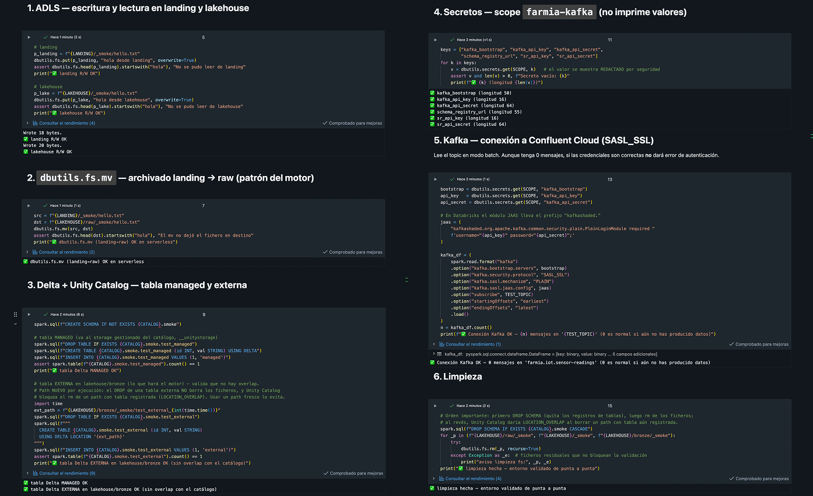

</details>

### 2 · `notebooks/02_generate_sample_data` — genera los datos de prueba

Genera los datos sintéticos (con Faker, deterministas por semilla) que alimentan el resto de la
práctica: escribe los cinco formatos batch en `landing` (convención `<source>/<dataset>/date=.../`) y
publica los eventos en Confluent (JSON singleplex, multiplex en `farmia.social.*`, y Avro con Schema
Registry). Los datos generados son en sí un entregable.

<details>
<summary><b>Ver captura y explicación</b> — ficheros en landing (5 formatos)</summary>

Árbol de `landing` con un fichero por dataset: JSON, CSV, Parquet, Avro e imágenes por etiqueta.

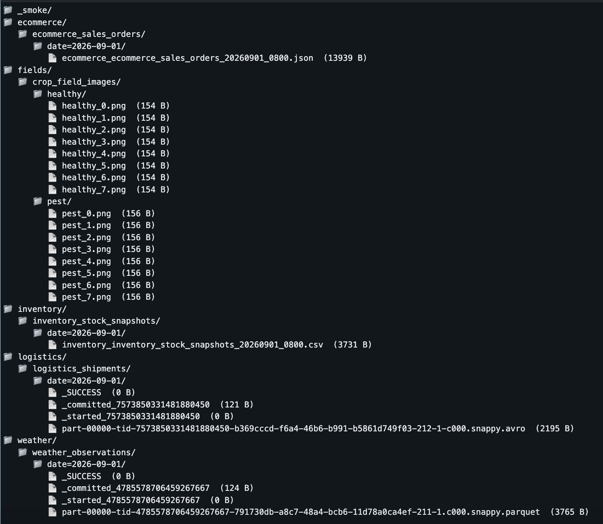

</details>

<details>
<summary><b>Ver captura y explicación</b> — topics con mensajes en Confluent</summary>

Los topics de Kafka con mensajes: IoT y app (singleplex), varios `farmia.social.*` (multiplex) y
pedidos (Avro + Schema Registry).

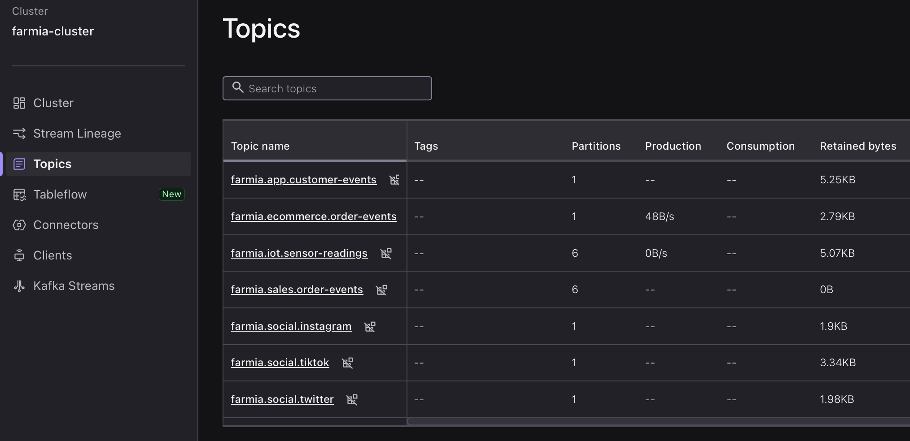

</details>

### 3 · `notebooks/10_run_batch` — ingesta batch `landing → bronze` (grupo `hourly`)

Recorre los 5 datasets batch con **aislamiento de errores** (si uno falla, el resto sigue) y devuelve
un **RunReport**. Por cada dataset lee de `landing` con Auto Loader, añade los metadatos de ingesta,
escribe la tabla Delta en bronze y **archiva los ficheros a `raw`**. Al final se demuestra la
**evolución de esquema**.

<details>
<summary><b>Ver captura y explicación</b> — RunReport (5 OK) + logs de archivado</summary>

Los 5 datasets salen en `OK` y, en los logs JSON, aparecen las líneas `archivado landing->raw` con el
nº de ficheros movidos por dataset (1/1/4/4/16). Demuestra la funcionalidad batch de punta a punta y
el patrón de archivado.

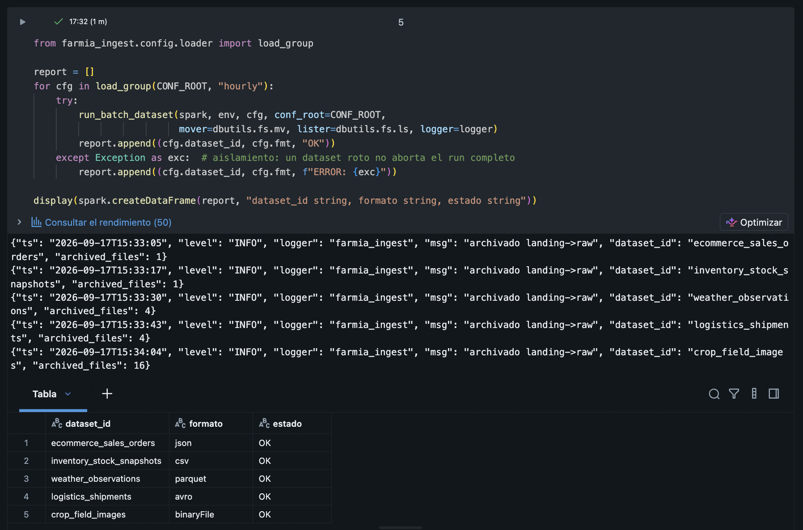

</details>

<details>
<summary><b>Ver captura y explicación</b> — tablas bronze con metadatos de ingesta</summary>

Cada tabla lleva al final las columnas `_ingest_ts`, `_source_file` e `_ingest_engine` (requisito de
"añadir metadatos a cada registro"). Van al final a propósito, para no gastar el presupuesto de
*data skipping* de Delta (que se calcula sobre las 32 primeras columnas).

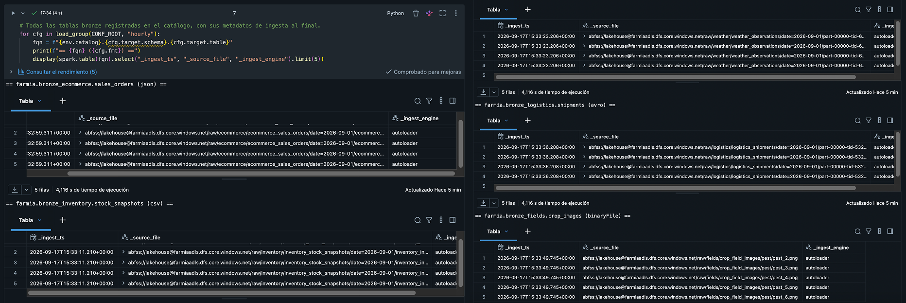

</details>

<details>
<summary><b>Ver captura y explicación</b> — ficheros archivados en raw</summary>

Los ficheros ya procesados aparecen en `lakehouse/raw/…`, movidos desde `landing`. Este patrón permite
reprocesar desde el original y mantener `landing` limpio (y, junto con el checkpoint, hace idempotente
el batch).

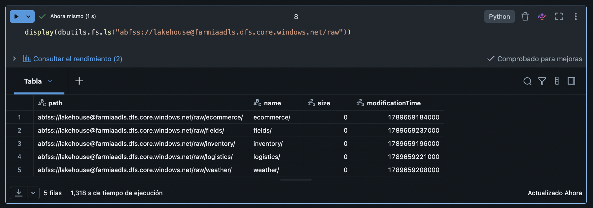

</details>

<details>
<summary><b>Ver captura y explicación</b> — evolución de esquema (columna nueva)</summary>

Se añade un JSON con una columna nueva (`discount_code`); Auto Loader la detecta, registra el nuevo
esquema y, en la siguiente pasada, la ingiere. La fila `ORD-999` aparece con la columna ya poblada.

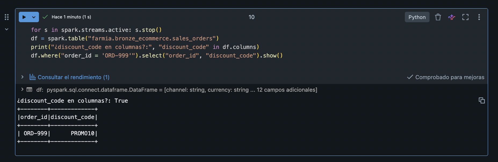

</details>

<details>
<summary><b>Ver captura y explicación</b> — catálogo Unity Catalog (schemas bronze_*)</summary>

Las tablas quedan registradas en Unity Catalog bajo los schemas `bronze_*` del catálogo `farmia` (una
base de datos por sistema de origen).

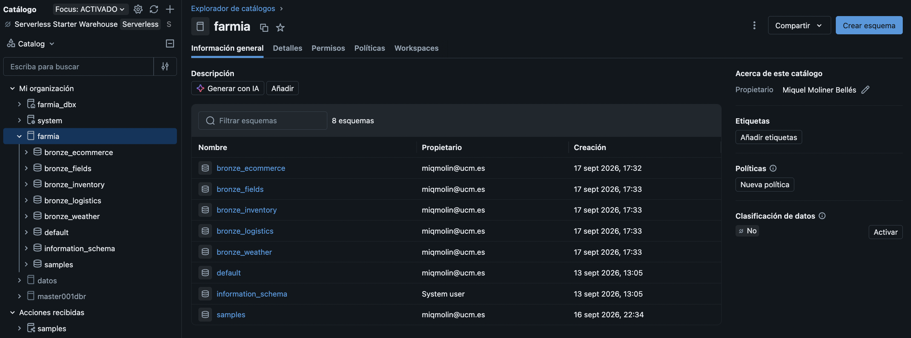

</details>

### 4 · `notebooks/11_run_streaming` — ingesta streaming `Kafka → bronze` (grupo `streaming`)

Levanta las 4 streaming queries y las ejecuta de forma acotada (`availableNow`, procesa lo publicado y
para): IoT y app (JSON singleplex), redes (multiplex) y pedidos (Avro + Schema Registry).

<details>
<summary><b>Ver captura y explicación</b> — estado de las 4 streaming queries</summary>

Las 4 queries en `OK`, cada una con su tipo (singleplex, multiplex, avro).

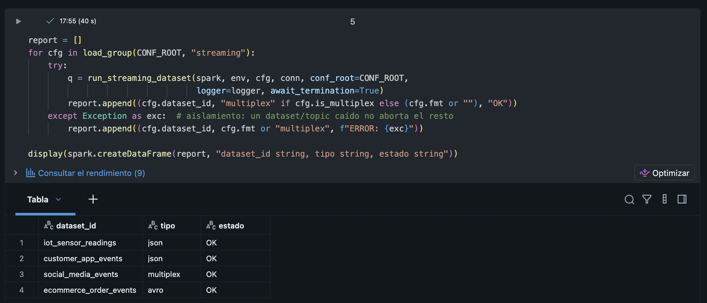

</details>

<details>
<summary><b>Ver captura y explicación</b> — Avro + Schema Registry sin nulls (wire format OK)</summary>

La tabla de pedidos muestra todas las columnas rellenas, sin `null`. Es la prueba de que el **wire
format de Confluent** se maneja bien: el motor salta la cabecera de 5 bytes
(`substring(value, 6, length(value)-5)`) antes de `from_avro`. Si se deserializara sin saltarla, todas
las columnas saldrían a `null`.

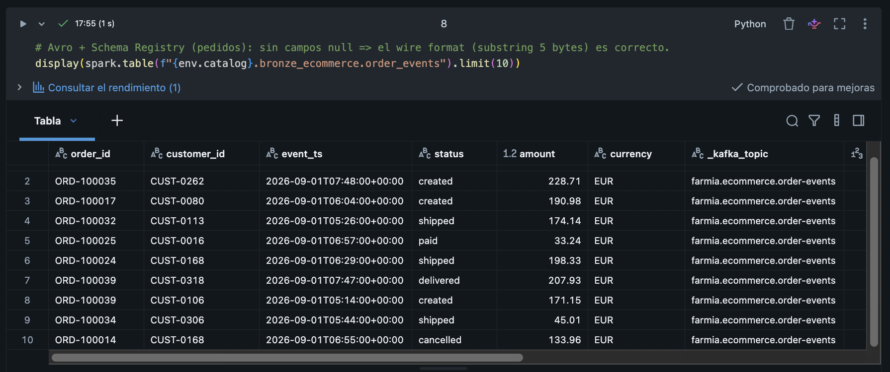

</details>

<details>
<summary><b>Ver captura y explicación</b> — multiplex particionado por _kafka_topic</summary>

Los eventos de redes llegan por varios topics `farmia.social.*` a **una sola query**
(`subscribePattern`), y la tabla queda particionada por `_kafka_topic`; el `groupBy` muestra una fila
por plataforma. El key/value se conserva binario en bronze y se estructuraría en silver.

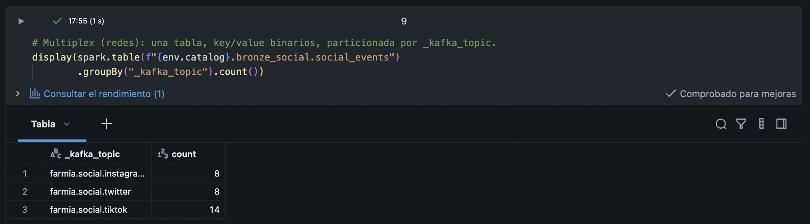

</details>

<details>
<summary><b>Ver captura y explicación</b> — IoT singleplex (JSON) con metadatos de Kafka</summary>

La tabla de sensores, con las columnas del evento deserializado y los metadatos de Kafka al final
(`_kafka_topic`, `_kafka_partition`, `_kafka_offset`, `_kafka_timestamp`).

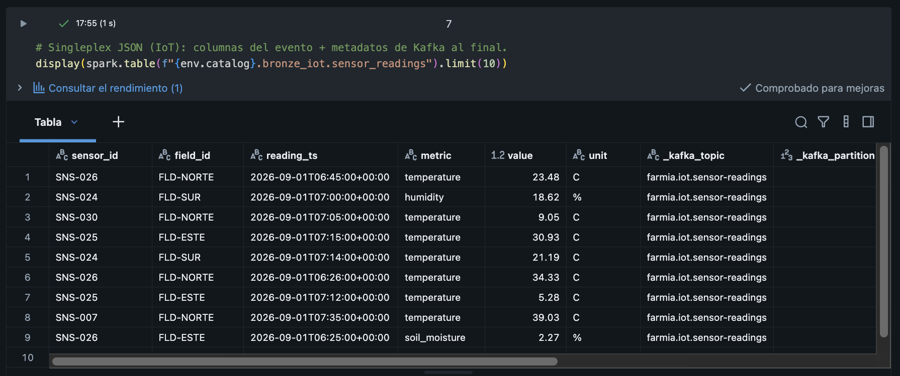

</details>

### 5 · `notebooks/30_test_scenarios` — escenarios "raros" (robustez)

Comprueba el comportamiento del motor ante situaciones que salen mal, que es lo que valora el enunciado.

<details>
<summary><b>Ver captura y explicación</b> — resiliencia ante un fichero corrupto (grupo entero OK)</summary>

Se inyecta un JSON corrupto en un dataset y se ejecuta el grupo entero. Auto Loader **tolera el
registro malformado** (lo aísla en la columna `_rescued_data` en vez de abortar), así que el run
termina con los 5 datasets en `OK`: resiliencia ante datos sucios. El motor **además aísla los errores
por dataset** en el runner (`orchestration/runner.py`): si un dataset fallara de forma irrecuperable,
se marcaría `ERROR` en el RunReport y el resto continuaría.

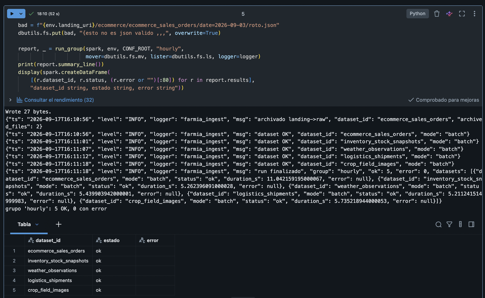

</details>

<details>
<summary><b>Ver captura y explicación</b> — idempotencia (no reingesta)</summary>

Re-ejecutar un dataset no vuelve a ingerir lo ya procesado (el checkpoint lo recuerda): las filas
antes y después coinciden.

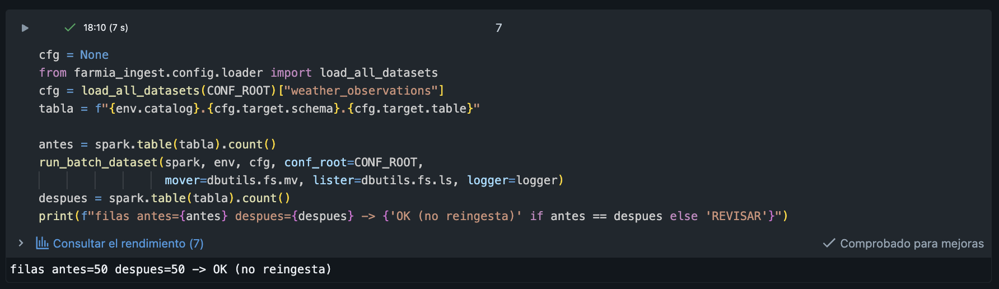

</details>

<details>
<summary><b>Ver captura y explicación</b> — evolución de esquema (ORD-EVO)</summary>

Variante del escenario del paso 3, aquí con el registro `ORD-EVO`, que aparece con la columna nueva
tras la evolución.

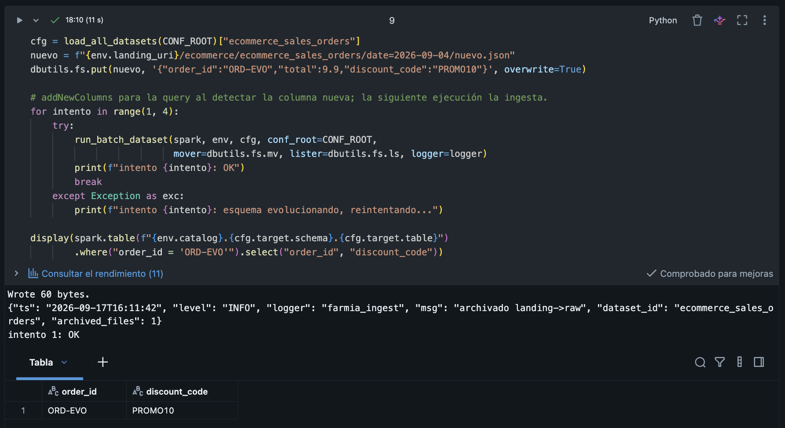

</details>

**Comprobaciones esperadas**: las tablas aparecen en el catálogo `farmia`; re-ejecutar batch **no**
reingesta (checkpoint); los ficheros se mueven a `raw`; una columna nueva se incorpora (mergeSchema).

---

## 9. Desarrollo local (tests sin Spark)

```bash
python3 -m venv .venv
./.venv/bin/pip install -e ".[dev,samples]"
./.venv/bin/pytest -q        # 59 tests, sin necesidad de Spark ni Databricks
```
Los tests cubren la lógica pura (config, validación, rutas, opciones de reader/kafka, wire format,
RunReport, generadores). El paquete **no importa pyspark al cargarse** (imports perezosos), por eso
se puede testear en local sin Spark ni cluster. La captura muestra los 59 tests pasando.

<details>
<summary><b>Ver captura y explicación</b> — 59 tests unitarios en verde</summary>

Los 59 tests pasan en local, sin Spark ni cluster (el paquete no importa pyspark al cargarse).

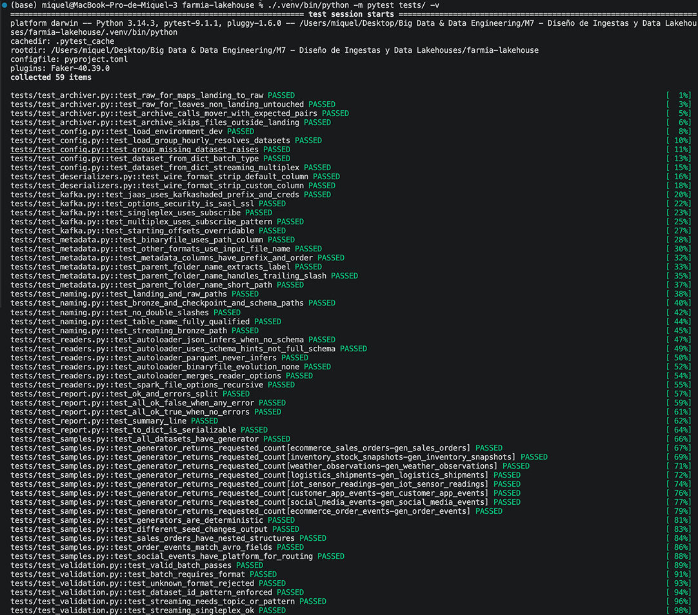

</details>

---

## 10. Uso de herramientas de IA

En este proyecto he utilizado una herramienta de IA (un asistente de programación) de forma amplia y
como parte activa del proceso de trabajo. La he empleado para:

- **Diseño y decisiones de arquitectura**: contrastar opciones (organización de las capas medallion,
  motor config-driven, engine intercambiable, patrón de archivado `landing → raw`, singleplex vs
  multiplex), tomando yo la decisión final en cada caso.
- **Generación de código**: producir el grueso del paquete `farmia_ingest` (readers, writers,
  pipelines, orquestación, configuración y validación), los notebooks, los generadores de datos
  sintéticos y los tests, que después he revisado, entendido y ajustado.
- **Depuración**: diagnosticar y resolver los problemas reales de ejecución en Databricks serverless
  (Spark Connect): `foreachBatch` no serializable, descubrimiento de Auto Loader, espera de las
  streaming queries, evolución de esquema, formatos binarios y dependencias.
- **Documentación**: redactar y estructurar este README, el documento de arquitectura, el diagrama y
  los comentarios del código.

En todo momento he trabajado **bajo criterio propio**: he dirigido el desarrollo, revisado cada
decisión y cada fragmento de código, ejecutado y **validado los resultados en el entorno real** (con
las capturas de la sección 8 como evidencia y con los tests en verde) y me he asegurado de **entender
cada pieza** antes de darla por buena. Los conceptos y la arquitectura están fundamentados en el
temario del módulo.
