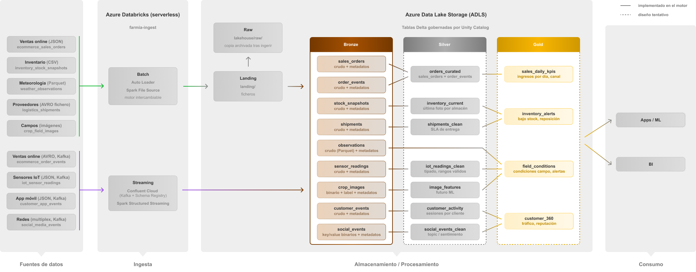

# Diseño de la arquitectura del lakehouse — FarmIA

> **Entregable 1** de la práctica (M7 · UCM/NTIC). Diseño del data lakehouse de FarmIA en Azure:
> el diagrama de **flujo de las tablas por capas** (medallion) y la explicación de cada capa.
> El **motor de ingesta** materializa hasta **bronze** (+ **raw**); **silver** y **gold** se dejan
> **diseñados de forma tentativa** (proyección), sin desarrollar, tal y como se acordó en la tutoría.

---

## 1. Diagrama de arquitectura — flujo de tablas (medallion) + infraestructura

Cada una de las 6 fuentes (9 datasets) aterriza en **landing** (ficheros) o en **topics de Kafka**
(eventos), el motor la ingesta a una tabla **bronze** (Delta, append + metadatos) y **se proyecta**
hacia silver/gold según su uso de negocio. El diagrama funde el flujo de tablas con las piezas
tecnológicas reales (Auto Loader · Confluent + Schema Registry · Spark Structured Streaming, sobre
Azure Databricks + ADLS Gen2 + Unity Catalog).

*(Sólido = implementado por el motor —landing · raw · bronze—. Discontinuo = diseño tentativo —silver · gold · consumo—. `observations` es el ejemplo de "no forzar capas": va directo de bronze a gold.)*

### Proyección tabla a tabla (bronze real → silver/gold tentativos)

| Fuente / dataset | Bronze (real) | Silver (tentativo) | Gold (tentativo) |
|---|---|---|---|
| Ventas online `ecommerce_sales_orders` (JSON) | `sales_orders` crudo + metadatos | `orders_curated`: items explotados, tipos casteados, upsert por `order_id` | `sales_daily_kpis`: ingresos por día/canal |
| Ventas online `ecommerce_order_events` (Avro/Kafka) | `order_events` crudo | fusionado en `orders_curated` (estado del pedido) | `sales_daily_kpis` |
| Inventario `inventory_stock_snapshots` (CSV) | `stock_snapshots` crudo | `inventory_current`: última foto por almacén/producto | `inventory_alerts`: bajo stock vs `reorder_point` |
| Meteorología `weather_observations` (Parquet) | `observations` crudo | **— (sin silver)**: Parquet ya tipado y usable | `field_conditions` **directo desde bronze**: condiciones por campo/día |
| Sensores IoT `iot_sensor_readings` (JSON/Kafka) | `sensor_readings` crudo | `iot_readings_clean`: tipado, rangos válidos | `field_conditions` (+ alertas) |
| App móvil `customer_app_events` (JSON/Kafka) | `customer_events` crudo | `customer_activity`: sesiones por cliente | `customer_360` |
| Redes `social_media_events` (multiplex/Kafka) | `social_events` (key/value binarios) | `social_curated`: estructurado por `topic` → sentimiento | `customer_360` (reputación) |
| Proveedores `logistics_shipments` (Avro fichero) | `shipments` crudo | `shipments_clean`: SLA de entrega | `inventory_alerts` (reposición) |
| Campos `crop_field_images` (imágenes) | `crop_images` (binario + `label`) | `image_features`: features de imagen (futuro ML) | `field_conditions` (salud del cultivo) |

> **No se fuerzan capas** (acuerdo de la tutoría): si un dato de bronze ya es usable, puede exponerse
> como **vista en gold** sin una tabla silver intermedia que no aporte.

---

## 2. Piezas tecnológicas (infraestructura real)

La infraestructura va integrada en el diagrama anterior. En resumen:

| Capa | Tecnología |
|---|---|
| Fuentes | ficheros (CSV·JSON·Parquet·Avro·imágenes) y eventos (IoT·app·redes·pedidos) |
| Ingesta batch | **Databricks Auto Loader** (`cloudFiles`) — o Spark file source (engine intercambiable) |
| Ingesta streaming | **Confluent Cloud** (Kafka + **Schema Registry**) + **Spark Structured Streaming** |
| Almacenamiento | **ADLS Gen2** `farmiaadls` (`landing` · `lakehouse`: `raw`/`bronze`) |
| Procesamiento / catálogo | **Azure Databricks** (serverless) · **Unity Catalog** (catálogo `farmia`, tablas Delta) |
| Consumo | BI / apps / ML sobre silver-gold (futuro) |

Diferencias con un diagrama de infraestructura "genérico": aquí **no** hay Azure Data Factory ni
Event Hubs ni Stream Analytics; la ingesta batch es **Auto Loader** y la streaming es **Kafka +
Spark Structured Streaming**, con **secretos en un secret scope** (`farmia-kafka`).

---

## 3. Explicación de cada capa

- **Landing** (contenedor `landing`): buzón de intercambio. Los sistemas origen (data owners)
  depositan aquí los ficheros crudos, con una convención de nombrado. Sin transformar.
- **Raw** (`lakehouse/raw`): copia **archivada** de los ficheros ya procesados (el motor los mueve
  de landing a raw tras ingerirlos). Permite **reprocesar** desde el original y mantener landing limpio.
- **Bronze** (`lakehouse/bronze`, catálogo `farmia`): **tablas Delta** con los datos **crudos +
  metadatos de ingesta** (`_ingest_ts`, `_source_file`…). Carga **siempre append**, esquema
  gobernado con **evolución** (`mergeSchema` + `schemaEvolutionMode`) y **validación mínima**. Es lo
  que implementa el motor. Tablas **externas** (mantenemos el control de los datos crudos).
- **Silver** (tentativo): datos **limpios, tipados, deduplicados** (MERGE/upsert), con la lógica de
  negocio (integrar CDC, resolver estado actual, explotar estructuras anidadas). Aquí es donde el
  multiplex se estructura por `topic`.
- **Gold** (tentativo): datos **curados para negocio/BI/ML** (agregados, KPIs, features), listos para
  consumir. Puede alimentarse de silver o, cuando el dato ya es usable, directamente de bronze (vista).

---

## 4. Decisiones de diseño y su justificación

| Decisión | Por qué |
|---|---|
| **Config-driven** (YAML por dataset + validación JSON Schema) | Añadir un dataset = una hoja, sin tocar código. Errores detectados antes de arrancar. |
| **Motor como paquete instalable** (wheel) + notebooks finos | Buenas prácticas de organización/modularidad; testeable y reutilizable en varios jobs. |
| **Engine intercambiable en batch** (`autoloader`/`spark`) | Leer ficheros con Auto Loader o con el file source nativo; portabilidad (Databricks o local). El streaming Kafka usa siempre Structured Streaming (no aplica el swap). |
| **Metadatos con `_` al FINAL** | Delta calcula data skipping sobre las 32 primeras columnas (Tema 4). |
| **Bronze externo** (no managed) | Control de los datos crudos; managed se reservaría a datasets críticos (DR). |
| **`append` en bronze; lógica de negocio en silver** | Bronze es el histórico crudo fiable; merges/overwrites se deciden aguas abajo (Tema 6). |
| **Singleplex vs multiplex** (Kafka) | Singleplex da esquema por tabla; multiplex aparca varios topics y valida en silver (Tema 7). |
| **Optimización** (`coalesce`, `autoOptimize`, particionado) | Ataca el small-file problem (Tema 3/4). |
| **Compatibilidad con serverless (Spark Connect)** | Escritura directa a tabla Delta (`toTable`, sin `foreachBatch`, no serializable en Connect); espera de streams por sondeo `isActive`; Auto Loader por inferencia de esquema; `binaryFile` con `schemaEvolutionMode: none`. |
| **Aislamiento de errores + RunReport** | Un dataset roto no aborta el run; trazabilidad del resultado. |
| **Secretos en secret scope** | Nunca credenciales en el código/YAML. |
